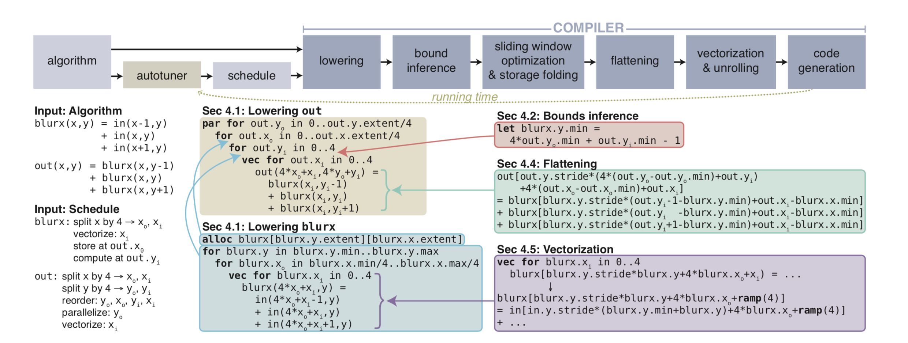

​		

##Halide: 

##A Language and Compiler for Optimizing Parallelism,Locality, and Recomputation in Image Processing Pipelines


## `Introduction`

### 	challenge  for image processing

Image processing pipelines combine the challenges of stencil computations and stream programs. They are composed of large graphs of different stencil stages, as well as complex reductions, and stages with global or data-dependent access patterns. Efficient implementations require optimization of both parallelism and locality, but due to the nature of stencils, there is a fundamental tension between parallelism, locality, and introducing redundant recomputation of shared values.

### What is halide

A systematic model of the tradeoff space fundamental to stencil pipelines, a schedule representation which describes concrete points in this space for each stage in an image processing pipeline, and an optimizing compiler for the Halide image processing language that synthesizes high performance implementations from a Halide algorithm and a schedule.

 ### feature

Combining this compiler with stochastic search over the space of schedules enables terse, composable programs to achieve state-of-the-art performance on a wide range of real image processing pipelines, and across different hardware architectures, including multicores with SIMD, and heterogeneous CPU+GPU execution. From simple Halide programs written in a few hours, we demonstrate performance up to 5× faster than hand-tuned C, intrinsics, and CUDA implementations optimized by experts over weeks or months, for image processing applications beyond the reach of past automatic compilers.

### Image Processing Pipelines

Stencils have been well studied in scientific applications in the form of iterated stencil computations, where one or a few small stencils are applied to the same grid over many iterations. In contrast, we are interested in other applications, in image processing

## 	`Halide DSL`

In Halide, values that would be mutable arrays in an imperative language are instead functions from coordinates to values. It represents images as pure functions defined over an infinite integer domain, where the value of a function at a point represents the color of the corresponding pixel. Pipelines are specified as chains of functions. Functions may either be simple expressions in their arguments, or reductions over a bounded domain. The expressions that define functions are side-effect free, and are much like those in any simple functional language, including:

​	• Arithmetic and logical operations;

​	• Loads from external images;

​	• If-then-else expressions;

​	• References to named values(which maybe function arguments, or expressions defined by a functional let 	construct);

​	• Calls to other functions, including external C ABI functions.

​	For example, a separable 3 × 3 unnormalized box filter is expressed as a chain of two functions in x, y:

​	
```Halide
	UniformImage in(UInt(8), 2)

	Var x, y

	Func blurx(x,y) = in(x-1,y) +

	Func out(x,y) = blurx(x,y-1) + blurx(x,y) + blurx(x,y+1)

```
​			
​		This representation is simpler than most functional languages

##  	`Scheduling Image Processing Pipelines`

Halide’s representation of image processing algorithms avoids imposing constraints on the order of execution and placement of data. Values need to be computed before they can be used, to respect
the fundamental dependencies in the algorithm, but many choices remain unspecified:

​	• When and where should the value at each coordinate in each function be computed?

​	• Where should they be stored?
​	• How long are values cached and communicated across multiple consumers, and when are they independently recomputed by each?

###	 Scheduling a Two-Stage Pipeline
The simple two-stage blur algorithm, which computes a3 × 3 box filter as two 3 × 1 passes. The first stage, blurx, computes a horizontal blur of the input by averaging over a 3 × 1 window:

**```blurx(x,y) = in(x-1,y) + in(x,y) + in(x+1,y)```**

The second stage, out, computes the final isotropic blur by averaging a 1 × 3 window of the output from the first stage:

**```out(x,y) = blurx(x,y-1) + blurx(x,y) + blurx(x,y+1)```**

First, it could compute and store every required point in blurx before evaluating any points in out. Applied to a 6 megapixel(3k × 2k) image, this is equivalent to the loop nest:

```
alloc blurx[2048][3072] 
for each y in 0..2048:
	for each x in 0..3072:
		blurx[y][x] = in[y][x-1] + in[y][x] + in[y][x+1]
alloc out[2046][3072] 
for each y in 1..2047:
	for each x in 0..3072:
		out[y][x]=blurx[y-1][x] + blurx[y][x] + blurx[y+1][x]
```

This is the most common strategy in hand-written pipelines, and what results from composing library routines together: each stage executes breadth-first across its input before passing its entire output to the next stage. There is abundant parallelism, since all the required points in each stage can be computed and stored independently, but there is little producer-consumer locality, since all the values of blurx must be computed and stored before the first one is used by out.

Interleaving the two stages, without storing the intermediate results across uses, is equivalent to the loop nest:

```
alloc out2046
for each y in 1..2047:
	for each x in 0..3072:
		alloc blurx[-1..1]
		for each i in -1..1:
			blurx[i]= in[y-1+i][x-1]+in[y-1+i][x]+in[y-1+i][x+1] 
		out[y][x] = blurx[0] + blurx[1] + blurx[2]

```

Each pixel can be computed independently, providing the same abundant data parallelism from the breadth-first strategy. The distance from producer to consumer is small, maximizing locality. But because shared values in blurx are not reused across iterations, this strategy performs redundant work. This can be seen as the result of applying classical loop fusion through a stencil dependence pattern: the body of the first loop is moved into the second loop, but its work is amplified by the size of the stencil

## 	`Compiling Scheduled Pipelines`


The compiler makes no heuristic decisions about which loop transformations to apply or what will generate fast code. For all such questions we defer to the schedule. At the same time, the generated code is safe by construction. The bounds of all loops and allocations are inferred. Bounds inference generates loop bounds that ultimately depend only on the size of the output image. Bounded loops are our only means of control flow, so we can guarantee termination.All allocations are large enough to cover the regions used by the program.

Given the functions defining a Halide pipeline and a fully specified schedule as input (Fig.1,left), our compiler proceeds through the major steps below.

​	

​										**Fig.1**

### Lowering and Loop Synthesis

Lowering begins from the function defining the output (in this case, out). Given the function’s domain order from the schedule, it generates a loop nest covering the required region of the output, whose body evaluates the function at a single point in that domain(Fig. 1, middle-top). The order of loops is given by the schedule, and includes additional loops for split dimensions. Loops are defined by their minimum value and their extent, and all loops implicitly stride by 1. This process rounds up the total traversed domain of dimensions which have been split to the nearest multiple of the split factor, since all loops have a single base and extent expression.

At this stage, loop bounds are left as simple symbolic expressions of the required region of the output function, which is resolved later.The bounds cannot have inter-dependent dimensions between the loops for a single function, so they represent a dense iteration over an axis-aligned bounding box. Each loop is labeled as being serial, parallel, unrolled, or vectorized, according to the schedule.

### Bounds Inference

For allocation sizes and loop bounds the pipeline relies on symbolic bounds variables for each dimension of each function.The next stage of lowering generates and injects appropriate definitions for these variables. Like function lowering, bounds inference proceeds recursively back from the output. For each function, it symbolically evaluates the bounds of each dimension based on the bounds required of its caller and the symbolic indices at which the caller invokes it. At each step, the required bounds of each dimension are computed by interval analysis of the expressions in the caller which index that dimension, given the previously computed bounds of all downstream functions.

After bounds inference has recursed to the top of the pipeline, it walks back down to the output, injecting definitions for the bounds variables used as stand-ins during lowering. They are defined by expressions which compute concrete bounds as a preamble at each loop level (in Fig, minimum bound of blurx.y is computed from interval analysis of the index expressions at which it is accessed combined with the bounds of the calling function, out).In practice, hoisting dynamic bounds evaluation expressions to the outermost loop level possible makes the runtime overhead of more complex bounds expressions negligible.

### 	Sliding Window Optimization and Storage Folding

After bounds inference, the compiler traverses the loop nests seeking opportunities for sliding window optimizations. If a realization of a function is stored at higher loop level than its computation, with an intervening serial loop, then iterations of that loop can reuse values generated by previous iterations. Using the same interval analysis machinery as in bounds inference, we shrink the interval to be computed at each iteration by excluding the region computed by all previous iterations. It is this transformation that lets us trade off parallelism (because the intervening loop must be serial) for reuse (because we avoid recomputing values already computed by previous iterations).

For example, in Fig. 1, **blurx** is stored for reuse within each tile of out, but computed as needed, for each scanline within the tile. Because scanlines (out.yi) are traversed sequentially, intermediate values of blurx are computed immediately before the first scanline of out which needs them, but may be reused my later scanlines within the tile. For each iteration of out.yi, the range of blurx.y is computed to exclude the interval covered by all prior iterations computed within the tile.

### Flattening

​	The compiler flattens multi-dimensional loads, stores, and allocations into their single-dimensional equivalent. This happens in the conventional way: a stride and a minimum offset are computed for each dimension, and the buffer index corresponding to a multidimensional site is the dot product of the site coordinates and the strides, minus the minimum. (Cf. Fig. 1, right.) By convention, we always set the stride of the innermost dimension to 1, to ensure we can perform dense vector loads and stores in that dimension. For images,this lays them out in memory in scanline order.

### 	Vectorization and Unrolling

After flattening, vectorization and unrolling passes replace loops of constant size scheduled as   vectorized or unrolled with transformed versions of their loop bodies. Unrolling replaces a loop of size n  with n sequential statements performing each loop iteration in turn.That is, it completely unrolls the loop.  Unrolling by lesser amounts is expressed by first splitting a dimension into two, and then unrolling the inner  dimension.

Vectorization completely replaces a loop of size n with a single statement. For example, in Fig. 1 (lower right), the vector loop over blurx.xi is replaced by a single 4-wide vector expression.Any occurrences of the loop index (blurx.xi) are replaced with a special value ramp(n) representing the vector [0 1…n − 1].    A type coercion pass is then run over this to promote any scalars combined with this.  Special   value to n-wide  broadcasts of the scalar expression. All of our IR nodes are meaningful for vector types:loads become gathers, stores become scatters, arithmetic becomes vector arithmetic, ternary expressions become vector  selects, and so on. Later, during code generation, loads and stores of a linear expression of k∗ramp(n)+o will become dense vector loads and stores if the coefficient k = 1, or strided loads and stores with stride k otherwise. In contrast to many languages, Halide has nodivergent control flow, so this transformation is always well-definedand straight-forward to apply. In our representation, we never split a vector into a bundle of scalars. It is always a single expression containing ramps and broadcast nodes. We have found  		that this yields extremely efficient code without any sort of generalized loop auto-vectorization.


### Back-end Code Generation

Finally, we perform low-level optimizations and emit machine code for the resulting pipeline. Our primary backends use LLVM for low-level code generation. We first run a standard constant-folding and dead-code elimination pass on our IR, which also performs symbolic simplification of common patterns produced by bounds inference.At this point, the representation is ready to be lowered to LLVM IR. There is mostly a one-to-one mapping between our representation and LLVM’s, but two specific patterns warrant mention.

First, parallel for loops are lowered to LLVM code that first builds a closure containing state referred to in the body of a for loop.The loop body is lowered to a separate function that accepts the closure as an argument and performs one iteration of the loop. We finally generate code that enqueues the iterations of the loop onto a task queue, which a thread pool consumes at runtime.

Second, many vector patterns are difficult to express or generate poor code if passed directly to LLVM. We use peephole optimization to reroute these to architecture-specific intrinsics. For example, we perform our own analysis pass to determine alignment of vector loads and stores, and we catch common patterns such as interleaving stores, strided loads, vector averages, clamped arithmetic, fixed-point arithmetic, widening or narrowing arithmetic, etc. By mapping specific expression IR patterns to specific SIMD opcodes on each architecture, we provide a means for the programmer to make use of all relevant SIMD operations on ARM (using NEON) and x86(using SSE and AVX).		


## `Autotuning Pipeline Schedules`

Halide applys stochastic search to automatically find good schedules for Halide pipelines. The automatic optimizer takes a fixed algorithm and attempts to optimize the running time by searching for the most efficient schedule. The schedule search space is enormous—far too large to search exhaustively. For example in the local Laplacian filters pipeline, we estimate a lower bound of 10720 schedules. This is derived by labeling functions with three tilings per function and all possible store and compute granularities. The actual dimensionality of the space is likely much higher. The optimal schedule depends  on machine architecture, image dimensions, and code generation in complex ways, and exhibits global dependencies between choices due to loop fusion and caching behavior.

### Schedule Search Space

Our full model of scheduling is per call but to simplify auto tuning we schedule each function identically across all call sites. The domain transformations include splitting and reordering dimensions, and marking them parallel, vectorized,or unrolled, or mapping a pair of dimensions to a GPU grid launch.Variable and block size arguments are randomized and chosen from small powers of two.

Because schedules have complex global dependencies, not all schedules are valid: for example, a schedule could be computed or stored inside a dimension that does not exist in the caller’s loop order.Genetic operations such as mutate and crossover may invalidate correct parent schedules. In general therefore we reject any partially completed schedules that are invalid, and continue sampling until we obtain valid schedules. We also verify the program output against a correct reference schedule, over several input images. This is just a sanity check: all valid schedules should generate correct code.Finally to prevent explosion of generated code due to complex pipelines, we limit the number of domain scheduling operations for each function.

### Search Starting Point One valid starting schedule is to label all

Functions as computed and stored breadth first (at the outermost, root granularity). The tuner converges from this starting point, albeit slowly. We can often do better by seeding the initial population with reasonable schedules. For each function we find its rectangular footprint relative to the caller (via bounds inference) and inline functions with footprint one. Remaining functions are stochastically scheduled as either (1) fully parallelized and tiled or (2) simply parallelized over y. We define fully parallelized and tiled as tiled over x and y, vectorized within the tile’s inner x coordinate, and parallelized over the y outer tile dimension. These choices are selected by a weighted coin that has fixed weight from zero to one depending on the individual. This allows us to often discover good starting points for functions that vectorize well, or fall back to naive parallelism when that is not the case. The dimensions x and y are chosen from adjacent dimensions at random, except when there are optional bounds annotations provided by the Halide programmer (such as the number of color channels): dimensions with small bound are not tiled.

### Genetic Algorithm Search 

halide uses a fixed population size and construct each new generation with population frequencies of elitism, crossover, mutated individuals, and  random individuals. Elitism copies the top individuals from the previous generation. Crossover selects parents by tournament selection, followed by two-point crossover, with crossover points selected at random between functions. Random individuals are generated either by the reasonable schedules described previously, or with equal probability, by scheduling each function independently with random schedule choices. This is directly derived from the PetaBricks autotuner.


​			
​		
​	


​			
​		
​	


​			
​		
​	


​	


​			
​		
​	


​			
​		
​				
​		
​	


​			
​		
​	


​			
​		
​	


​			
​		
​	


​			
​		
​				
​		
​	


​			
​		
​	

​		
​	


​			
​		
​	


​	


​			
​		

​		


​			
​		
​	


​			
​		
​				
​		
​	


​			
​		
​	


​			
​		
​	


​			
​		
​	

​	


​			
​		
​	

​		
​		
​	
```

```