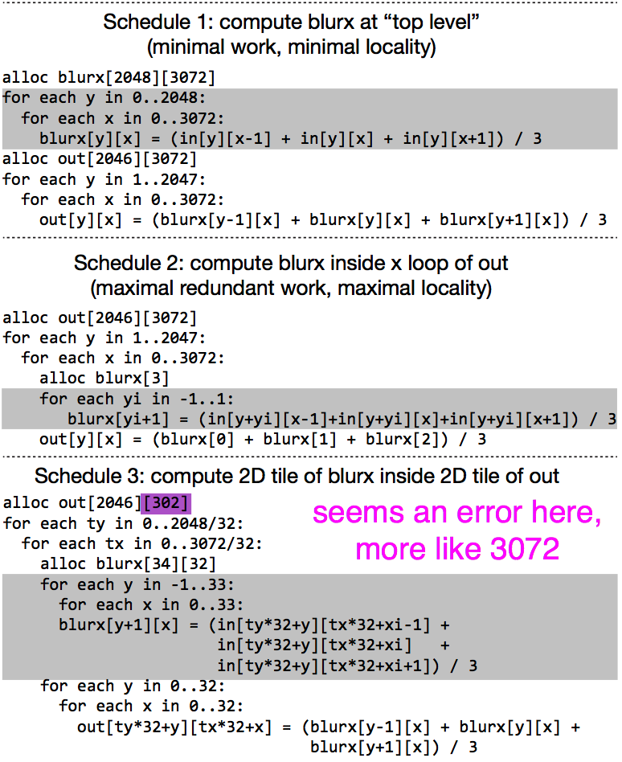
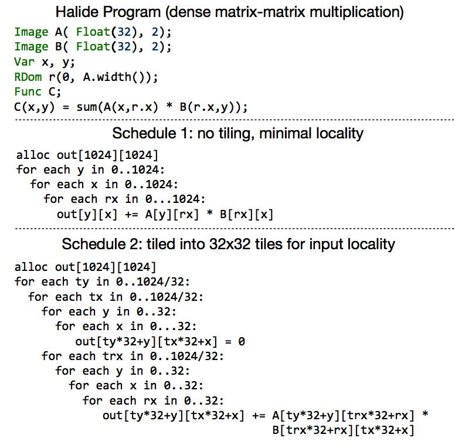

## Automatically Scheduling Halide Image Processing Pipelines

### Some words used ( Some has its definition )

#### `Halide`

Image processing language for authoring high-performance image processing code.

#### `Halide compiler`

Generating *platform-specific* code.

#### `Schedule`

A compact, functional description of an image processing algorithm and a separate, high-level description of how to globally optimize the algorithm’s execution on a machine.

#### `Reuse distance`

The time between accesses to the same piece of data.

#### `Producer-Consumer Locality` `Input Resue` `Function Bounds Analysis`...

### Main work(or idea)

The main idea is to partition the functions in a large Halide program into groups (subprograms), and independently perform producer-consumer locality and input reuse locality transformations on these groups.

Cause A good Schedule can have good:

1. Producer-Consumer Locality;

2. Input Reuse;

Those can be true through `Function Bounds Analysis`.

### Algorithm

#### Need

In addition to an unmodified Halide program, the auto-scheduler requires as input an estimate of concrete bounds for the domain of the program’s output function (e.g., the size of the outputs) as well as concrete bounds for any inputs that cannot be directly inferred from the output bounds.

#### Step

1. Function Preprocessing
2. Function Groups and Tiling
3. Function Inlining
4. Final Schedule Generation

#### `1. Function Preprocessing`

1. Estimate arithmetic cost
2. Compute concrete bounds
3. Compute per-direction input reuse

#### `2. Function Groups and Tiling`

1. Enumerate all remaining group merging opportunities.
2. For each merging opportunity, estimate the performance bene- fit of merging the two groups. The act of evaluating the benefit of a merge requires determining a tiled loop-nest structure for the potential merged group.
3. Select the merge that yields the greatest performance benefit (provided at least one merge that provides benefit does exist) and merge the two groups.

#### `3. Function Inlining`(这一块没有弄懂，需要讨论)

1. Inlining can be applied to functions with multiple consumers.
2. The auto-scheduler must consider the cost of inlining a function into all consumers.
3. The auto-scheduler substitutes the producer function expression into the consumer function and reevaluates the arithmetic cost of the new expression.

#### `4. Final Schedule Generation`

1. Reorder each group output function’s loops in order of maximal input locality.
2. Unrolls the innermost loop if it contains only a small number of iterations.
3. Parallelizes as many outermost dimensions of the loop nest as necessary to obtain sufficient multi-core parallelism for the target machine.

### 总结

图像处理涉及的其实是大量的循环操作，如何组织这些循环使得计算机（目标机）能够有效的计算这些循环（Cache利用率，并行性）是Halide要解决的问题。问题的难度在于即使是很有经验的工程师也很难确定这些次序。本文介绍的是一种自动生成代码的算法，它通过对操作（Function）的Input，Output（以此确定函数为Consumer，Producer）的重用（Reuse）的分析，尽可能高的保证在Cache中的数据会被用到，同时又使得这个量不太大，机器能够运行。值得注意的是，它是机器相关的算法，需要得到机器的状态，如Cache size等。
